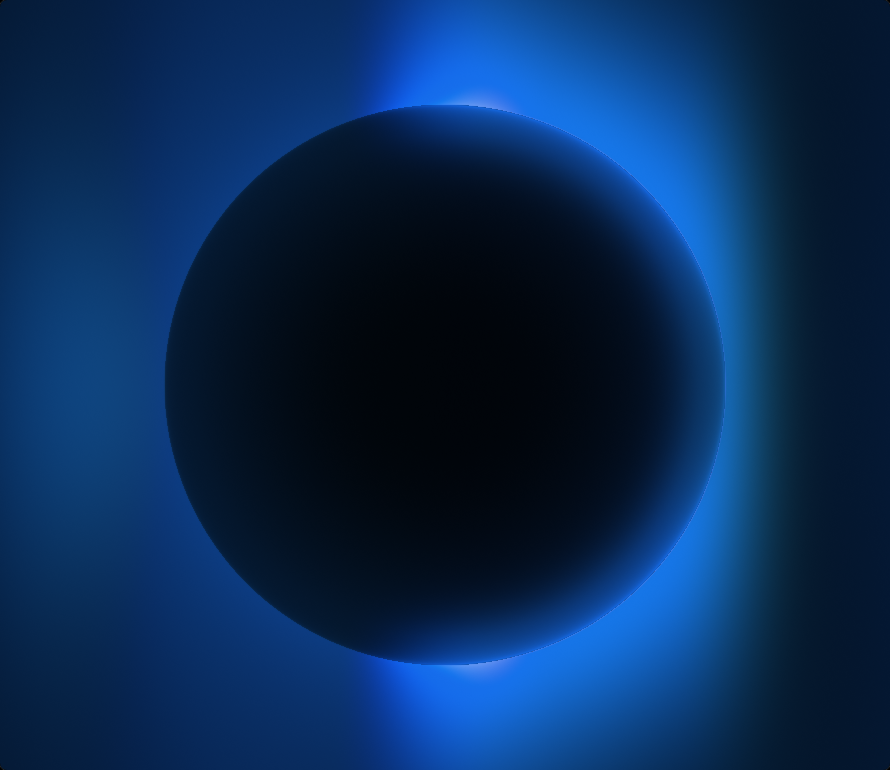
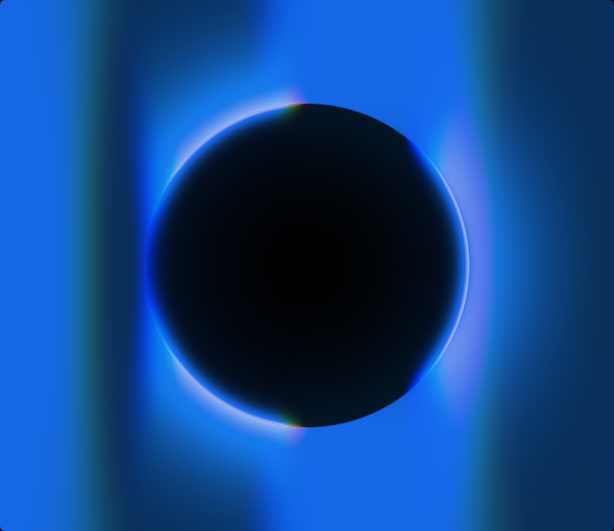
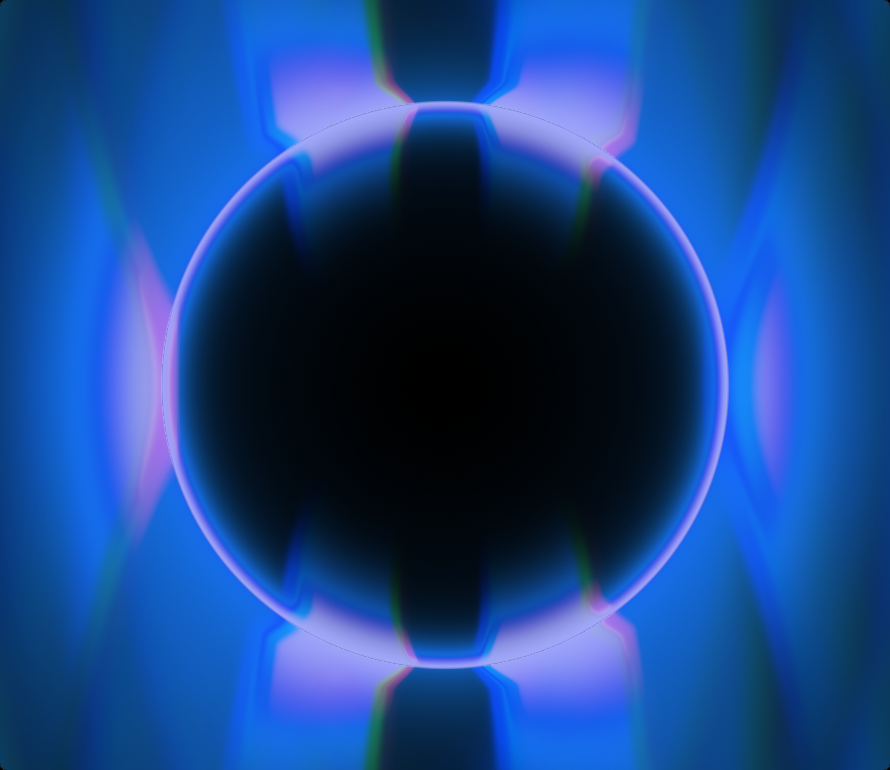
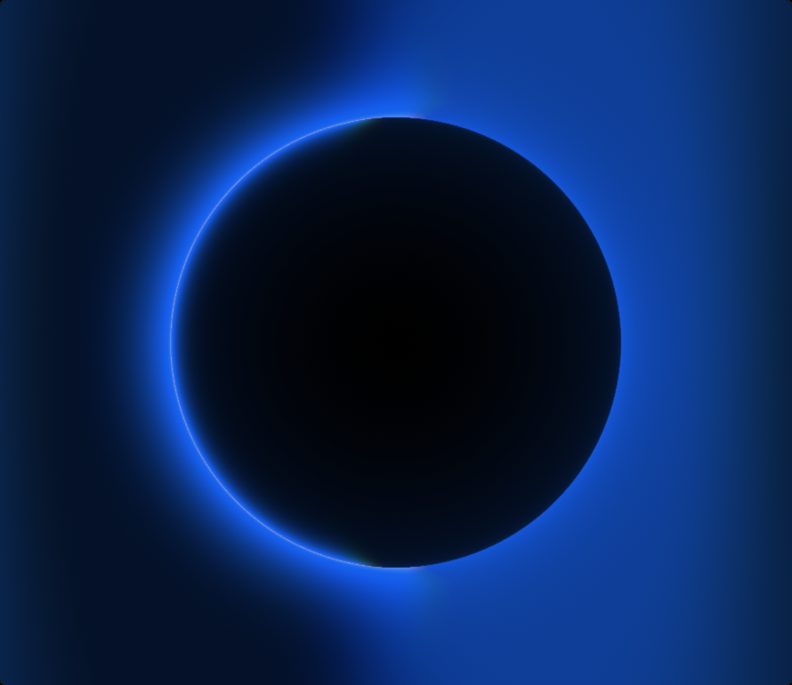

# Shaders for pen.dev

Experimental shader workbench for making polished, production-safe GLSL fills for
[`pen.dev`](https://pen.dev).

<p>
  
</p>

This repo is for exploring a small family of highly art-directed shaders:
dark thermal spheres, directional corona lighting, soft blooming tubes, chromatic
edges, blur, glow, and motion-friendly parameters.

The important idea is restraint. Each shader can contain many internal controls,
but only a deliberately small set is exposed to pen.dev users. The exposed
sliders are the ones that keep the result inside a strong visual range, so people
can dial the look without pushing the shader into muddy, broken, or suboptimal
states.

## Preview Wall

### Thermal

| Default | Shadow | Fav 1 | Fav 2 WIP |
| --- | --- | --- | --- |
|  |  |  |  |

### Thermal 2

| Default | Fav 1 | Video Match |
| --- | --- | --- |
|  |  |  |

| Fav 2 | Fog |
| --- | --- |
|  |  |

### Tube

| Default | Fav 1 | Closer |
| --- | --- | --- |
|  |  |  |

## What This Is

This is a React + Vite shader workbench. It parses annotated GLSL files, renders
them in WebGL, and maps shader uniforms into editable controls. The goal is to
iterate quickly on shader behavior while keeping the final Pencil/pen.dev control
surface intentionally narrow.

The shader files live in [`app/src/experiments`](app/src/experiments):

- [`thermal.glsl`](app/src/experiments/thermal.glsl): dark sphere, softbox sweep,
  thermal corona, bloom, and depth blur.
- [`thermal-2.glsl`](app/src/experiments/thermal-2.glsl): a more directional
  corona model with richer shadow, fog, rim, and drop-shadow controls.
- [`tube.glsl`](app/src/experiments/tube.glsl): soft 3D tube with path curvature,
  travelling light, focus blur, glow spill, and chromatic dispersion.

## Technical Principle

The shader may have a deep internal parameter set, but the pen.dev-facing API
should be curated.

Good exported controls are broad, stable, and hard to misuse:

- color key
- size and position
- loop duration
- glow or bloom amount
- high-level shape/path controls
- focus or softness controls when they preserve the composition

Controls that can easily damage the art direction stay internal:

- fragile lighting constants
- low-level shadow math
- scattering coefficients with narrow sweet spots
- debug toggles
- parameters that only work in combination with other hidden values

That is the core design contract: give users enough control to make the shader
theirs, but not enough rope to destroy the look.

## Local Development

```sh
cd app
npm install
npm run dev
```

Vite runs at:

```txt
http://localhost:5194/
```

Useful checks:

```sh
cd app
npm run typecheck
npm test
npm run build
```

## Capturing README Previews

The preview images in `docs/previews` are real canvas captures from the local app.
To regenerate them:

```sh
cd app
npm install
npm install --no-save playwright
npx playwright install chromium
cd ..
node scripts/capture-previews.mjs
```

The script expects the dev server to be running on `http://localhost:5194/`.
